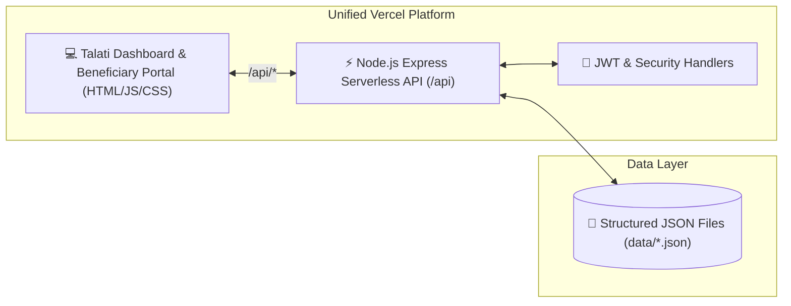

<div align="center">

# 🏦 Pali CBDC Ration Distribution Management Portal

<p align="center">
  
  
  
  
  
</p>

<p align="center">
  <b>Central Bank Digital Currency (CBDC) Beneficiary Allocation, Verification, and Distribution Auditing Platform</b>
</p>

<p align="center">
  
</p>

</div>

---

## 🌟 Overview

**Pali CBDC Ration Distribution Portal** is a specialized GovTech web platform built for digital ration entitlement tracking and CBDC wallet transaction verification in Pali village. It automates beneficiary record lookup, allocation status tracking, quota deductions, and Talati audit log generation.

---

## ✨ Key Features

- ⚡ **High-Speed Node.js Backend:** Express REST API for instant beneficiary lookup by Ration Card ID, Aadhaar number, or family head name.
- 🗄️ **JSON Data Storage:** All beneficiary records (270 members), metadata, users, and audit logs stored directly in structured JSON format without external database dependencies.
- 📊 **Talati Administrative Dashboard:** Real-time analytics on daily grain distributions, CBDC voucher redemptions, pending disbursements, and village quota fulfillment.
- 🛡️ **Audit Logs & Security:** Tamper-evident transaction logging tracking time, officer ID, and beneficiary verification status with JWT authentication and bcrypt password hashing.
- ☁️ **Full Vercel Integration:** Both static frontend and serverless API are unified in a single deployment on **Vercel** with zero external database dependencies.

---

## 🏗️ Architecture Flow



---

## 📁 Repository Structure

```
CBDCP/
├── api/
│   └── index.js              # Express API (Vercel Serverless Function & local router)
├── lib/
│   └── dataStore.js          # JSON Data Access Layer (in-memory + disk persistence)
├── data/
│   ├── data.json             # Beneficiary records (270) and village metadata
│   ├── users.json            # Authentication credentials (Talati user)
│   └── audit_logs.json       # Onboarding audit history
├── frontend/
│   ├── index.html            # Dashboard web interface
│   ├── vercel.json           # Vercel deployment routing & rewrites
│   └── assets/               # CSS styles, JS logic, and fallback datasets
├── server.js                 # Local Node.js development server
├── vercel.json               # Root Vercel deployment configuration
├── package.json              # Node.js dependencies and scripts
└── README.md                 # Project documentation
```

---

## 🚀 Getting Started

### 1. Prerequisites
- **Node.js**: v18.0.0 or higher
- **npm**: v9.0.0 or higher

### 2. Local Setup
```bash
# Clone the repository
git clone https://github.com/ra901625072-boop/pali.git
cd pali

# Install dependencies
npm install
```

### 3. Run Development Server
```bash
npm start
```
The server will start at `http://localhost:8080`.
- **Website UI:** `http://localhost:8080/`
- **REST API:** `http://localhost:8080/api/beneficiaries`
- **Default Talati Login:** `nikunjdarji` / `Nikunj@97`

---

## 🌐 Production Deployment (Vercel)

Deploying to **Vercel** is now fully automatic with zero external services required:

1. Push your changes to GitHub.
2. Import the repository into [Vercel](https://vercel.com).
3. Deploy! Vercel automatically detects the static frontend and the `/api` Serverless Functions.
4. No external database or Render configuration is required.

---

## 👨‍💻 Author

**Akshaysinh Rajput**
- 🌐 Portfolio: [portfolioakshay.in](https://portfolioakshay.in)
- 💼 LinkedIn: [Akshaysinh Rajput](https://www.linkedin.com/in/akshaysinh-rajput-8a575532b/)
- 🐙 GitHub: [@ra901625072-boop](https://github.com/ra901625072-boop)