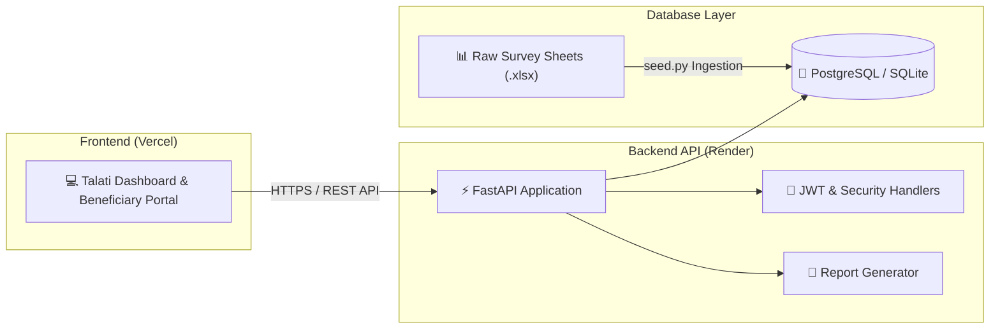

<div align="center">

# 🏦 Pali CBDC Ration Distribution Management Portal

<p align="center">
  
  
  
  
  
  
</p>

<p align="center">
  <b>Central Bank Digital Currency (CBDC) Beneficiary Allocation, Verification, and Distribution Auditing Platform</b>
</p>

<p align="center">
  
</p>

</div>

---

## 🌟 Overview

**Pali CBDC Ration Distribution Portal** is a specialized GovTech web platform built for digital ration entitlement tracking and CBDC wallet transaction verification in Pali village. It automates beneficiary record lookup, allocation status tracking, quota deductions, and Talati audit log generation.

---

## ✨ Key Features

- ⚡ **High-Speed FastAPI Backend:** Async REST API for instant beneficiary lookup by Ration Card ID, Aadhaar number, or family head name.
- 🗄️ **Automated Seeding & Data Ingestion:** Dedicated database seeding script (`seed.py`) converting raw survey sheets (`raw data.xlsx`) into PostgreSQL / SQLite records.
- 📊 **Talati Administrative Dashboard:** Real-time analytics on daily grain distributions, CBDC voucher redemptions, pending disbursements, and village quota fulfillment.
- 🛡️ **Audit Logs & Security:** Tamper-evident transaction logging tracking time, officer ID, and beneficiary verification status.
- ☁️ **Hybrid Production Architecture:** Backend deployed on **Render** with CORS proxying to a responsive frontend hosted on **Vercel**.

---

## 🏗️ Architecture Flow



---

## 📁 Repository Structure

```
CBDCP/
├── backend/
│   ├── main.py               # FastAPI application & route endpoints
│   ├── seed.py               # Database ingestion and seeding script
│   ├── requirements.txt      # Python dependencies for Render / local runtime
│   ├── database.db           # SQLite database (development)
│   ├── raw data.xlsx         # Reference survey source records
│   └── reports/              # Generated audit reports
├── frontend/
│   ├── index.html            # Dashboard web interface
│   ├── vercel.json           # Vercel deployment routing & API rewrites
│   └── assets/               # CSS styles, JS logic, and fallback datasets
├── .gitignore                # Git exclusions
└── README.md                 # Project documentation
```

---

## 🚀 Getting Started

### 1. Prerequisites
- Python 3.10+
- `pip`

### 2. Local Setup
```bash
# Clone the repository
git clone https://github.com/ra901625072-boop/pali.git
cd pali

# Setup virtual environment
python -m venv venv
venv\Scripts\activate        # Linux/macOS: source venv/bin/activate

# Install dependencies
pip install -r backend/requirements.txt
```

### 3. Database Seeding
```bash
# Seed initial beneficiary records
python backend/seed.py

# Force re-seeding / reset database:
python backend/seed.py --force
```

### 4. Run Development Server
```bash
python backend/main.py
```
FastAPI server starts at `http://127.0.0.1:8080`.

---

## 🌐 Production Deployment

- **Backend (Render):** Deploy `backend/` folder as a Python Web Service. Set start command: `python main.py`.
- **Frontend (Vercel):** Deploy `frontend/` folder. The `vercel.json` file handles reverse proxying `/api/*` to the Render backend.

---

## 👨‍💻 Author

**Akshaysinh Rajput**
- 🌐 Portfolio: [portfolioakshay.in](https://portfolioakshay.in)
- 💼 LinkedIn: [Akshaysinh Rajput](https://www.linkedin.com/in/akshaysinh-rajput-8a575532b/)
- 🐙 GitHub: [@ra901625072-boop](https://github.com/ra901625072-boop)